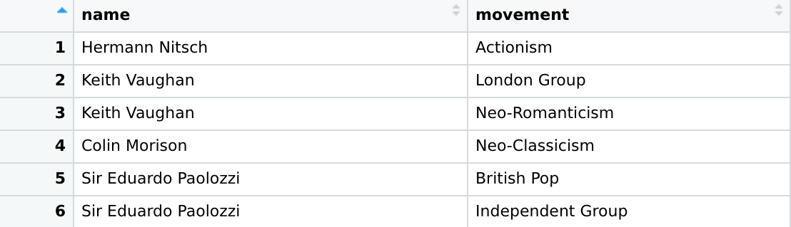
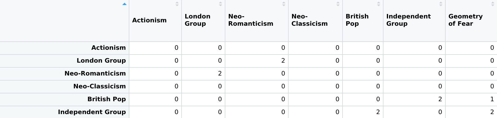

# Final Project

Unlike history books, artworks show us the zeitgeist of artists’ times and locations from a more humanistic perspective. They help us emphasize with the subject, and perhaps even put ourselves in their shoes. I find studying artworks very interesting for this reason, so I chose to model art history for this project using Tate Museum’s dataset of artists.

There are two main components to this analysis: a bipartite network projection and a weighted undirected graph. The program uses data.csv to construct the initial graph for bipartite projection. The structure of the graph is as follows: we have two types of nodes, one for artist and one for the art movement. An edge exists between any artist node and art movement node if and only if the artist was a member of that movement.

Then for the bipartite matrix, we have the following:

For example, the weight of the edge between Neo-Romanticism and London Group is 2, which is the number of artists that were members of both movements. We plot this graph using this projection matrix:

After running PageRank algorithm on the bipartite graph, I found that _Constructivism_ was the one with the highest score, which was very surprising, because I initially thought that _British War Art_ would have the highest score, since this dataset has a high concentration of British art movements that were formed in 1900-1950s, and they were all heavily influenced by the two world wars that happened in those years. Furthermore, _Constructivism_ was founded by two Russian artists and was associated with Soviet socialism, a movement Britain was in war against. However, upon further look, I noticed that although _British War Art_ had more edges, the weight of edges was higher for _Constructivism_, and it was connected to other very popular art movements such as Cubism and Surrealism, which are not connected to _British War Art_. So although _British War Art_ is more locally connected, _Constructivism_ is more “globally” and densely connected.

I then calculated eigenvector centralities of vertices and here are the art movements with scores > 0.5.

| Art Movements   | Eigenvector Centralities | Art Movements        | Eigenvector Centralities |
| --------------- | ------------------------ | -------------------- | ------------------------ |
| Body Art        | 0.7962309426             | Abstraction-Création | 0.9398831841             |
| Kinetic Art     | 0.5290818501             | Conceptual Art       | 0.7313366010             |
| St. Ives        | 0.8389071819             | Unit One             | 0.6011128330             |
| Performance Art | 1.0                      | Constructivism       | 0.9868920510             |

Below is the ego network of _Performance Art_ of order 2. It wasn’t surprising that the art movement with the highest eigenvector centrality score is one of the more modern movements. As I briefly mentioned in my homework 1, modern art movements are much more connected to each other, and their degrees are also higher than others. However, I would expect that _Conceptual Art_ would have somewhat higher score than _Performance Art_, since it is much more influential in art history. But this may also be due to the dataset limitations since it’s mostly focused on British artists.

As a last method of analysis of bipartite projection graph, I found articulation points of the graph. Articulation points are cuts in the sense that if we removed one, the number of connected components in the graph would increase. Following are the articulation points of this graph:

I won’t be focusing on every single one of the articulation points. Personally, the most interesting one seems to be St. Ives School. The fact that it is an articulation point tells us that there are components of art movements that are connected to St. Ives School by a single edge only. In the context of art history, this could mean that artists in diverse range of art movements were also members of St. Ives School, which is indeed true. For example, Ben Nicholson, a member of St. Ives School, also participated in movements such as _Abstraction-Création, Constructivism, Cubism_, and _Surrealism_. Another one of its members, Christopher Wood, was a prominent member of _Neo-Romanticism_. These movements have very little in common, both in style and subject matter. However, these diverse artists become members of St. Ives School to portray West Cornwall in their own voices, whether that be in cubism or surrealism. I found the concept of articulation point in art history personally very interesting.

# Part 2 - Weighted Undirected Graph and Clustering

Here is our dataset for the second graph model:

Two artists in this graph are connected if they both participated in the same art movement. For example, there is an edge with movement attribute “St. Ives School” between Trevor Bell and Anthony Benjamin because they are both members of the St. Ives movement. Note that multiple edges between two vertices are allowed, since two artists may be both members of more than a single art movement. To make visualization easier, I created another dataset in the following form:

The vertices are still artists, but I “collapsed” art movements into a single edge and added the weight attribute. So whereas in the first graph there would be two edges between Man Ray and Max Ernst (one for Dada and one for Surrealism), in this graph there is only one edge with movement attribute “Dada, Surrealism” and weight of 2. The plot of this new graph is given below.

However, this graph is only used for plotting purposes. The analysis will be done on the first graph in which multiple edges between the same two vertices are allowed. To start off, I calculated a few metrics for each connected component of the graph. I mistakenly thought that graph would have more densely connected components, but it turned out that there is only one densely connected component and the rest are very small ones that do not tell us much.

| Component ID | Number of Vertices | Number of Edges | Avg. Path Length | Avg. Degree Centrality |
| ------------ | ------------------ | --------------- | ---------------- | ---------------------- |
| 1            | 835                | 11409           | 4.743738         | 27.32695               |
| 2            | 7                  | 21              | 1.000000         | 6.00000                |
| 3            | 5                  | 10              | 1.000000         | 4.00000                |
| 4            | 4                  | 6               | 1.000000         | 3.00000                |
| 5            | 11                 | 61              | 1.000000         | 11.09091               |
| 6            | 6                  | 15              | 1.000000         | 5.00000                |
| 7            | 2                  | 1               | 1.000000         | 1.00000                |
| 8            | 3                  | 3               | 1.000000         | 2.00000                |
| 9            | 5                  | 7               | 1.300000         | 2.80000                |
| 10           | 3                  | 3               | 1.000000         | 2.00000                |
| 11           | 2                  | 1               | 1.000000         | 1.00000                |
| 12           | 2                  | 1               | 1.000000         | 1.00000                |

Running Girvan-Newman algorithm, we find the following clustering that maximizes modularity:

The number of clusters that maximizes modularity is 55, which is much higher than I originally thought. There were many clusters with only one vertex, which is not very common in recent art history, if at all, as artists rarely work in a single subject matter with a single style. I believe this speaks to the limited nature of our dataset rather than the interactions, or lack thereof, between art movements.

### **Cluster 1**

|     | Movement Name          | Edge Count |
| --- | ---------------------- | ---------- |
| 1   | St. Ives School        | 276        |
| 2   | Constructivism         | 322        |
| 3   | Abstraction-Création   | 15         |
| 4   | Bauhaus                | 6          |
| 5   | British Constructivism | 91         |
| 6   | Tachism                | 10         |
| 7   | Kinetic Art            | 1          |
| 8   | Neo-Plasticism         | 1          |

with average degree centrality of 24.26923 and average mean distance of 1.603318. Below is the bipartite projection of this cluster.

This is a medium/large sized cluster that includes some interesting art movements such as St. Ives School, Kinetic Art and Constructivism. The inclusion of St. Ives in this cluster emphasizes my prior point about how diverse the movement was. Initially, I was surprised by the presence of Tachism, Kinetic Art, and Constructivism. But this surprise was mostly due to my ignorance. Upon further studying, I found that there are indeed major thematic similarities between these movements, and that the intersection of artists in these movements is large. First of all, these are all modern / abstract art movements, but what really ties them together is their common subject matter of industrialism (except St. Ives School) and undertones of cubism.

### **Cluster 2**

|     | Movement Name         | Edge Count |
| --- | --------------------- | ---------- |
| 1   | British War Art       | 903        |
| 2   | British Surrealism    | 276        |
| 3   | Neo-Romanticism       | 136        |
| 4   | Vorticism             | 45         |
| 5   | Unit One              | 15         |
| 6   | Group X               | 6          |
| 7   | London Group          | 6          |
| 8   | Objective Abstraction | 3          |
| 9   | Abstraction-Création  | 1          |
| 10  | Direct Carving        | 1          |
| 11  | Euston Road School    | 1          |
| 12  | Seven and Five        | 1          |

with average degree centrality of 33.59036 and average mean distance of 1.620335. Below is the bipartite projection of this cluster.

This is a large sized cluster that is mainly composed of British art movements that were formed in years 1900-1950.

Although clustering algorithm did capture some of the underlying similarities between art movements, I am not entirely convinced by its performance. For example, Vorticism, Constructivism and Abstract-Creation were all very intertwined with the Cubism movement (in fact, Cubism was the starting point of Constructivism) , but they were not in the same cluster. Furthermore, so many of the artists in British War Art and Constructivism were also members of Return to Order, which was in a completely different cluster. In fact, Return to Order was clustered with Cubism, even though they are vastly different from each other. The former was formed, in a sense, in opposition to movements like Cubism.
